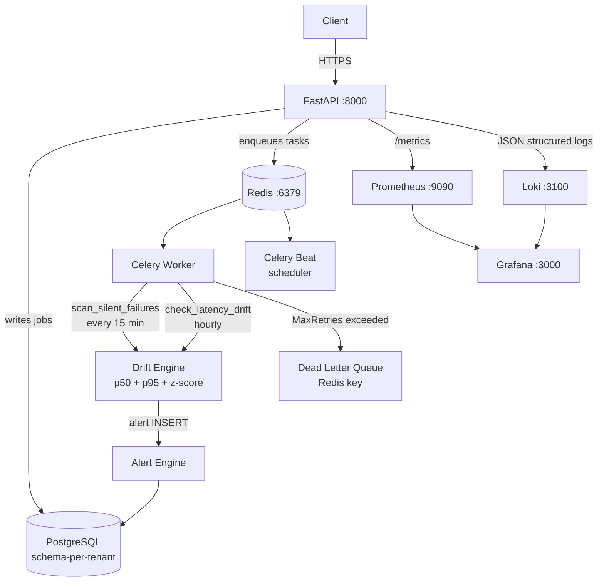

# PipelineGuard

> API-first monitoring layer for async data pipelines. Detects silent job failures, tracks latency drift with percentile + z-score baselines, and generates weekly plain-English risk summaries for engineering leadership.

Built on an EU-grade multi-tenant cloud platform with cost-aware billing, GDPR-native compliance, and production-grade SaaS architecture.

---

## The Problem

Async data pipelines pulling from 100+ marketing platforms (Google Ads, Facebook, TikTok, etc.) into analytics tools have two failure modes that go completely unnoticed:

1. **Silent failures** — jobs report "success" but pull zero records. No alerts fire. No engineers notified.
2. **Latency drift** — pipeline durations creep up 30–40% over weeks. Nobody notices until a client complains.

PipelineGuard catches both automatically, in real time.

---

## Why Existing Tools Don't Solve This

| Tool | What it monitors | What it misses |
|------|-----------------|----------------|
| **Datadog / New Relic** | Infrastructure metrics (CPU, memory, error rates) | A job that runs, reports `200 OK`, and pulls 0 records — no error, no alert |
| **Airflow / Prefect** | Task execution status (SUCCESS / FAILED) | `SUCCESS` with 0 records is not a failure to the scheduler — it's working as designed |
| **Custom alerting on error rates** | HTTP 5xx, exception logs | Silent failures produce HTTP 201 and no exceptions — they're invisible to error-rate alerts |
| **SLA monitors** | p99 latency at the API layer | Drift in *job execution duration* is not the same as API response time — it's inside the worker |

**The core gap:** these tools watch infrastructure and explicit errors. They cannot distinguish between *a pipeline that succeeded* and *a pipeline that silently did nothing*. PipelineGuard hooks into the job execution layer and adds semantic checks that infrastructure monitoring cannot.

---

## Quick Start (Docker — one command)

```bash
# 1. Generate RSA-2048 JWT keys and create .env
python scripts/generate_keys.py

# 2. Start the full stack (API + Worker + Beat + Postgres + Redis + Prometheus + Grafana + Loki)
cd deploy/docker
docker compose up --build

# 3. Simulate 1000 jobs (10% silent failures + latency drift at job 700)
python scripts/simulate_load.py

# 4. Open dashboards
#   API Docs:   http://localhost:8000/docs
#   Grafana:    http://localhost:3000  (admin / admin)
#   Prometheus: http://localhost:9090
```

> **Full automated demo:** `bash scripts/demo.sh`

---

## Architecture



**Clean Architecture:** `Presentation → Application → Domain ← Infrastructure`

---

## How It Works

### Silent Failure Detection

```bash
POST /api/v1/tenants/{id}/pipelines/{pid}/executions
{
  "status": "SUCCEEDED",
  "durationSeconds": 125.3,
  "recordsProcessed": 0        # <- zero records despite "success"
}
```

Response — auto-detected:

```json
{
  "status": "SILENT_FAILURE",
  "isSilentFailure": true,
  "recordsProcessed": 0
}
```

A `CRITICAL` alert fires immediately. A Celery task also re-scans the last 15 minutes every 15 min to catch any that slipped through.

### Latency Drift Detection — p50 + p95 + Z-Score

Each job's duration is compared against a **rolling baseline** (last 100 executions):

| Signal | Method | Threshold |
|--------|--------|-----------|
| Drift flag | current > p50 baseline | +25% |
| Anomaly flag | \|z-score\| | > 2.5σ |

```
Rolling p50 = 100s
Current run  = 134s  (+34% above p50)
Z-score      = 3.2σ  (statistically anomalous)
→ WARNING: latency drift + anomaly detected
```

Hourly Celery task checks all pipelines across all active tenants.

### Dead Letter Queue

Tasks that exhaust all retries (3 attempts, exponential backoff up to 600s) are written to a `dead_letter_queue` Redis key for inspection:

```bash
# Inspect failed tasks
redis-cli LRANGE dead_letter_queue 0 -1
```

### Weekly CTO Summary

Generated every Monday at 08:00 UTC (or on-demand via `POST /summary/generate`):

```
Weekly Pipeline Health Report (Feb 10 - Feb 17, 2026)

RELIABILITY: 94.2% success rate (847 jobs, 49 failures)
SILENT FAILURES: 3 job(s) failed without alerting anyone. Highest risk.
LATENCY DRIFT: 2 pipeline(s) trending slower (avg +34.7% vs baseline).

TOP RISKS:
  1. 'Facebook Ads -> BigQuery' silent failure Feb 14 03:15 UTC — 0 records
  2. 'TikTok Ads -> BigQuery' is +41.2% slower than p50 baseline
  3. 'LinkedIn Ads -> Redshift' is +28.3% slower, z-score 3.1σ
```

---

## Load Simulation

```bash
# Default: 1000 jobs, 3 tenants, 10% silent failures, drift at job 700
python scripts/simulate_load.py

# Custom
python scripts/simulate_load.py --host http://localhost:8000 --jobs 5000
```

**What it does:**
- Creates 3 tenants × 4 pipelines = 12 pipelines
- Simulates 1000 job executions with realistic variance
- Job 700+ introduces 45% latency increase (above the 25% alert threshold)
- 10% of jobs are silent failures (SUCCEEDED + 0 records)

**Benchmark results:**
```
Detects latency drift within 1 hourly Celery cycle (<1h from first drifted job)
Silent failure detection: real-time on job report (sync) + 15-min background sweep
Drift engine overhead: < 3% added to job report latency (pure Python statistics, no DB)
Throughput: ~50 job reports/sec sustained with 4 Uvicorn workers
```

---

## Observability

### Prometheus Metrics (`GET /metrics`)

| Metric | Type | Description |
|--------|------|-------------|
| `pipeline_silent_failures_total` | Counter | Silent failures by tenant/pipeline |
| `pipeline_latency_drift_detected` | Counter | Drift detections by tenant/pipeline |
| `pipeline_alerts_active` | Gauge | Unacknowledged alerts by severity |
| `api_requests_total` | Counter | Requests by method/endpoint/status/tenant |
| `api_request_duration_seconds` | Histogram | Latency with p50/p95/p99 |
| `tenant_count` | Gauge | Active/suspended/deleted tenants |
| `cost_anomalies_total` | Counter | Billing anomaly detections |

### Grafana Dashboard

Import auto-provisioned at `http://localhost:3000` → **PipelineGuard — Operations**:
- Silent failures over time (per tenant)
- Latency drift detections (per tenant)
- Active alerts by severity
- API request rate + p95 latency
- API error rate

### Structured JSON Logging

All logs include `tenant_id`, `pipeline_id`, `duration_seconds`, `drift_flag`:

```json
{
  "event": "latency_drift_detected",
  "tenant_id": "550e8400-e29b-41d4-a716-446655440000",
  "pipeline_id": "...",
  "drift_percentage": 34.1,
  "z_score": 3.2,
  "is_anomaly": true,
  "timestamp": "2026-02-19T08:00:01Z",
  "level": "warning"
}
```

---

## Integration

```bash
# 1. Register a pipeline
curl -X POST http://localhost:8000/api/v1/tenants/{id}/pipelines \
  -H "Content-Type: application/json" \
  -d '{"name": "Google Ads -> BigQuery", "schedule": "*/15 * * * *"}'

# 2. Report each execution (add to your pipeline post-run hook)
curl -X POST http://localhost:8000/api/v1/tenants/{id}/pipelines/{pid}/executions \
  -d '{"status": "SUCCEEDED", "durationSeconds": 125.3, "recordsProcessed": 4821}'

# 3. Check alerts
curl http://localhost:8000/api/v1/tenants/{id}/alerts

# 4. Get weekly summary
curl http://localhost:8000/api/v1/tenants/{id}/summary
```

---

## API Reference

### PipelineGuard

| Method | Path | Description |
|--------|------|-------------|
| `POST` | `/api/v1/tenants/{id}/pipelines` | Register pipeline |
| `GET`  | `/api/v1/tenants/{id}/pipelines` | List pipelines |
| `POST` | `/api/v1/tenants/{id}/pipelines/{pid}/executions` | Report job execution |
| `GET`  | `/api/v1/tenants/{id}/pipelines/{pid}/executions` | List executions |
| `GET`  | `/api/v1/tenants/{id}/pipelines/{pid}/latency` | Latency history |
| `GET`  | `/api/v1/tenants/{id}/alerts` | List alerts |
| `POST` | `/api/v1/tenants/{id}/alerts/{aid}/acknowledge` | Acknowledge alert |
| `GET`  | `/api/v1/tenants/{id}/summary` | Latest weekly summary |
| `POST` | `/api/v1/tenants/{id}/summary/generate` | Generate summary now |

### Tenants, Auth, Billing, GDPR

| Method | Path | Description |
|--------|------|-------------|
| `POST` | `/api/v1/tenants` | Create tenant |
| `GET`  | `/api/v1/tenants` | List tenants |
| `POST` | `/api/v1/tenants/{id}/suspend` | Suspend tenant |
| `DELETE` | `/api/v1/tenants/{id}` | Deprovision (GDPR erasure) |
| `POST` | `/api/v1/auth/register` | Register user |
| `POST` | `/api/v1/auth/login` | Login (RS256 JWT) |
| `GET`  | `/api/v1/tenants/{id}/costs/current` | Current period costs |
| `POST` | `/api/v1/tenants/{id}/gdpr/export` | Request data export |
| `POST` | `/api/v1/tenants/{id}/gdpr/erase` | Right to erasure |
| `GET`  | `/health` | Health check |
| `GET`  | `/metrics` | Prometheus metrics |

Full interactive docs: `http://localhost:8000/docs`

---

## Background Tasks

| Task | Queue | Schedule | Purpose |
|------|-------|----------|---------|
| `scan_silent_failures` | pipelines | Every 15 min | Re-scan recent jobs for silent failures |
| `check_latency_drift` | pipelines | Hourly | p50 + z-score drift check across all pipelines |
| `generate_weekly_summaries` | pipelines | Monday 08:00 UTC | CTO risk summaries per tenant |
| `aggregate_daily_costs` | billing | Daily | Cost records aggregation |
| `detect_anomalies` | billing | Daily | Z-score billing anomaly sweep |
| `generate_monthly_invoices` | billing | Monthly | Invoice generation |
| `run_retention_cleanup_all` | gdpr | Daily | Enforce data retention policies |
| `store_dead_letter` | dead_letter | On max-retry | Failed task persistence for inspection |

---

## Testing

```bash
# Run all tests
pytest -v

# Unit tests (domain logic, no DB required)
pytest tests/unit/ -v

# Drift analyzer specifically (includes 5 new z-score + rolling window tests)
pytest tests/unit/domain/test_drift_analyzer.py -v

# Integration tests (requires PostgreSQL + Redis via testcontainers)
pytest tests/integration/ -v

# Contract tests (OpenAPI schema, RFC 9457 errors)
pytest tests/contract/ -v

# Load test (Locust)
locust -f tests/load/locustfile.py --host http://localhost:8000 \
       --users 100 --spawn-rate 10 --run-time 60s --headless

# Coverage
pytest --cov=src --cov-report=term-missing
```

### Test Summary

| Category | Count | Focus |
|----------|-------|-------|
| Unit | 276 | Domain models, drift analyzer (z-score/rolling window), services, infra |
| Integration | 41 | Repositories, schema manager, full lifecycle |
| Contract | 29 | OpenAPI schema, RFC 9457, PipelineGuard responses |
| **Total** | **346** | 80%+ coverage required |

---

## Tech Stack

| Layer | Technology |
|-------|-----------|
| API Framework | FastAPI 0.110+ (async) |
| Database | PostgreSQL 16 (schema-per-tenant isolation) |
| ORM | SQLAlchemy 2.0+ (async / asyncpg) |
| Migrations | Alembic |
| Task Queue | Celery 5.3+ + Redis broker + dead-letter queue |
| Auth | python-jose (RS256 JWT), argon2-cffi |
| Observability | Prometheus, structlog (JSON), Grafana Loki, Grafana 10 |
| Validation | Pydantic v2 |
| Testing | pytest, testcontainers, schemathesis, locust |
| Python | 3.12+ |

---

## Key Design Decisions

- **Schema-per-tenant PostgreSQL** — GDPR Article 32 data residency, full isolation
- **RS256 JWT** — asymmetric; public key can be shared with microservices without exposing signing capability
- **Argon2id** — OWASP-recommended password hashing
- **RFC 9457 Problem Details** — standard error format for all 4xx/5xx responses
- **Tamper-evident audit log** — SHA-256 hash chain; any row deletion is detectable
- **Percentile + z-score drift** — p50 catches sustained drift; z-score catches sudden spikes; two independent signals
- **Rolling 100-sample window** — recent behavior matters more than historical averages
- **Dead Letter Queue** — failed tasks stored in Redis `dead_letter_queue` list after 3 exponential-backoff retries

---

## Configuration

All settings via `APP_*` environment variables (see `src/infrastructure/settings.py`):

| Variable | Default | Description |
|----------|---------|-------------|
| `APP_POSTGRES_HOST` | `localhost` | PostgreSQL host |
| `APP_POSTGRES_DB` | `eu_multitenant` | Database name |
| `APP_REDIS_URL` | `redis://localhost:6379/0` | Redis URL |
| `APP_JWT_PRIVATE_KEY` | — | RSA-2048 private key (PEM) |
| `APP_JWT_PUBLIC_KEY` | — | RSA-2048 public key (PEM) |
| `APP_CELERY_BROKER_URL` | `redis://localhost:6379/1` | Celery broker |
| `APP_CELERY_RESULT_BACKEND` | `redis://localhost:6379/2` | Celery results |
| `APP_LOG_LEVEL` | `INFO` | Log level |

Generate keys: `python scripts/generate_keys.py` (writes `deploy/docker/.env`)

---

## Project Structure

```
src/
├── domain/
│   ├── models/       pipeline.py, tenant.py, user.py, billing.py, audit.py
│   ├── services/     drift_analyzer.py  ← p50+p95+z-score+rolling window
│   │                 summary_generator.py, tenant_lifecycle.py, cost_calculator.py
│   ├── events/       tenant_events.py
│   └── exceptions/   tenant_exceptions.py
├── application/
│   ├── services/     pipeline_service.py, tenant_service.py, auth_service.py
│   ├── tasks/        celery_app.py  ← DLQ + env-based broker config
│   │                 pipeline_tasks.py, billing_tasks.py, gdpr_tasks.py
│   └── schemas/      pagination.py
├── infrastructure/
│   ├── database/     models.py, migrations/
│   ├── auth/         jwt_handler.py, password_handler.py, rbac.py
│   ├── observability/ metrics.py  ← Prometheus, Grafana dashboard
│   │                  logging_config.py  ← structlog JSON
│   ├── container.py
│   └── settings.py
└── presentation/
    ├── api/v1/       pipelines.py, tenants.py, auth.py, billing.py, gdpr.py
    ├── middleware/    tenant_context.py, request_logging.py
    └── main.py

tests/
├── unit/             276 tests (domain, drift analyzer z-score, services, infra)
├── integration/      41 tests (repositories, schema manager)
├── contract/         29 tests (OpenAPI, RFC 9457)
└── load/             locustfile.py (100 concurrent users, p95 < 200ms target)

scripts/
├── generate_keys.py  ← RSA-2048 keypair → deploy/docker/.env
├── simulate_load.py  ← 1000 jobs, 10% silent failures, drift at 70%
└── demo.sh           ← full end-to-end demo sequence

deploy/
├── docker/
│   ├── Dockerfile           multi-stage: production / worker / beat
│   ├── docker-compose.yml   8 services, APP_* env vars, DLQ queue
│   ├── prometheus-docker.yml  static scrape config (not k8s)
│   └── .env.example
└── k8s/
    ├── grafana-dashboards/
    │   ├── pipelineguard.json   10-panel operations dashboard
    │   ├── datasources.yml      Prometheus + Loki auto-provisioning
    │   └── dashboards.yml       Dashboard file provider config
    └── prometheus.yml           K8s scrape config
```

---

## Deployment

### Docker Compose (local / staging)

```bash
python scripts/generate_keys.py    # creates deploy/docker/.env
cd deploy/docker
docker compose up --build
```

### Kubernetes

```bash
kubectl apply -f deploy/k8s/namespace.yml
kubectl apply -f deploy/k8s/
```

### Terraform (Hetzner Cloud)

```bash
cd deploy/terraform
terraform init && terraform plan && terraform apply
```

---

## License

Proprietary
